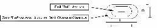
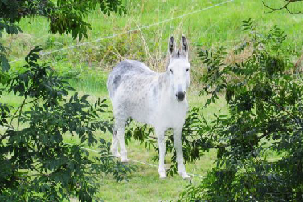
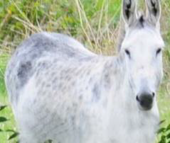
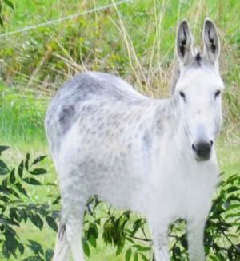

# B.5 Les cibles

## B.5.1 Nombre de cibles

| Types de cibles | Parcours de 21 cibles à tirer deux fois | Parcours de 42 cibles à tirer une fois |
| --------------- | :-------------------------------------: | :------------------------------------: |
| Grands Gibiers  |                    4                    |                   8                    |
| Moyens Gibiers  |                    7                    |                   14                   |
| Petits Gibiers  |                    6                    |                   12                   |
| Petits Animaux  |                    4                    |                   8                    |

## B.5.2 Les blasons

Seuls les blasons animaliers sont autorisés (pas de cibles volumétriques).
Ils comportent obligatoirement 2 zones :

- **La zone "blessé"** correspondant au contour de l'animal. Les blasons qui ne possèdent pas ce tracé et qui figurent sur le livret officiel des blasons homologués FFTA, doivent être tracés, à l'initiative de l'organisateur, et être présentés aux archers avant le concours.
- **La zone "tué"** correspondant au centre vital du corps de l'animal. Cette zone doit être tracée de façon très significative avec un gabarit.
- **La zone "petit tué" de la catégorie "arc libre**" correspond au centre de la grande zone "tué". Cette zone doit être retracée de façon très significative avec un gabarit pour une tolérance de centrage de + ou –2mm.
- **Traçage de la petite zone "tué" de la catégorie "arc libre" :** les deux zones se superposent et doivent être
  de formes identiques. Elles sont tracées de façon équidistante en hauteur (D) et en largeur (L) des axes
  verticaux et horizontaux de la grande zone "tué". La tolérance de centrage est de + ou – 2mm.

  Les blasons peuvent être découpés selon le contour de l'animal, en laissant une marge de 1cm minimum
  autour de celui-ci. Ils doivent être collés sur un carton support.

  Les blasons sont classés par catégories suivant le diamètre de la zone "tué". Pour les animaux ayant une
  zone "tué" ovale, considérer 2 dimensions "D" et "L" : voir dessin ci-dessous :

  

Quatre catégories sont définies d'après leurs grandes zones "tué".

La tolérance de traçage est de + ou – 2mm.

## B.5.3. Dimensions des zones "tué"

Dimensions des Zones 'Tué" pour tous les types d'arc sauf l'Arc Libre :

| Types de cibles | Zones rondes     | Zones Ovales        |
| --------------- | ---------------- | ------------------- |
| Grands Gibiers  | "Tué" = Ø 300 mm | D 225 mm × L 360 mm |
| Moyens Gibiers  | "Tué" = Ø 225 mm | D 180 mm × L 275 mm |
| Petits Gibiers  | "Tué" = Ø 150 mm | D 115 mm × L 180 mm |
| Petits Animaux  | "Tué" = Ø 75 mm  | D 60 mm × L 95 mm   |

Dimensions des Zones "Tué" pour l'Arc Libre :

| Types de cibles | Zones rondes     | Zones Ovales        |
| --------------- | ---------------- | ------------------- |
| Grands Gibiers  | "Tué" = Ø 150 mm | D 115 mm × L 180 mm |
| Moyens Gibiers  | "Tué" = Ø 150 mm | D 115 mm × L 180 mm |
| Petits Gibiers  | "Tué" = Ø 75 mm  | D 60 mm × L 95 mm   |
| Petits Animaux  | "Tué" = Ø 75mm   | D 60 mm × L 95 mm   |

## B.5.4. Positionnement et fixation

Les blasons peuvent être inclinés, mais jamais à l'envers.

La partie la plus basse de la zone "blessé", sur les buttes de tir, ne doit jamais être à moins de 10cm du sol.

Les animaux doivent être identifiables depuis le pas de tir.

**Recommandation :** afin d'éviter des difficultés inutiles et absurdes, la position et l'inclinaison des blasons doivent restituer l'animal en position naturelle (on n'a jamais vu un sanglier incliné à 45 degrés dans la nature).

**Petits animaux :** il est obligatoire de positionner 2 blasons sur 1 ou 2 buttes de tir : un blason sera repéré par une marque rouge, le second par une marque bleue et blanche (la couleur des marques est en rapport avec la couleur des pas de tir).

L'archer tire 1 seule flèche par blason, à part pour les catégories U18, U15 et U13 qui doivent tirer leurs deux flèches dans le blason avec une marque bleue et blanche.

## B.5.5 Création de blasons, règles d'homologations des blasons parcours nature

### B.5.5.1 Définition des surfaces des zones "blessé" suivant le type de gibier

- Petits Animaux : la surface de la zone blessée doit être comprise entre 4 et 15 fois la surface
  de la zone tuée ronde. Soit entre 176cm² et 660 cm²
- Petits Gibiers : la surface de la zone blessée doit être comprise entre 4 et 9 fois la surface de
  la zone tuée ronde. Soit entre 704cm² et 1584 cm²
- Moyens Gibiers : la surface de la zone blessée doit être comprise entre 4 et 9 fois la surface
  de la zone tuée ronde. Soit entre 1590 cm² et 3582 cm²
- Grands Gibiers : la surface de la zone blessée doit être au minimum de 4 fois la surface de la
  zone tué ronde. Soit 2828 cm² minimum.

### B.5.5.2 Règles particulières

- La zone "blessé" au niveau des pattes devra s'arrêter au niveau de la première articulation (genoux).

  

- Les zones non marquantes (becs, cornes, branches, herbes…) ne devront pas se trouver sur une zone
  marquante.
- On devra voir l'intégralité du corps de l'animal et au moins la moitié des pattes, pas de rognage pour
  entrer l'animal dans un format papier déterminé.

   

        Rognage refusé                            Rognage accepté

- Il n'y a pas obligation d'un format identique de support par type de gibier. Les photos d'animaux de forme humanoïde sont interdites.)
- La photo de l'animal devra être nette (sans bavures, sans pixellisation).

### B.5.5.3 Les informations à transmettre lors de la demande d'homologation

Fournir un tirage papier en grandeur réelle de chaque blason faisant la demande d'homologation.

Ce tirage devra être sur le support papier qui sera celui du tirage final et imprimé sur les mêmes moyens de production.

Le papier devra être de bonne qualité (ne pas se déchirer lors du collage sur un support, résistant à l'eau,…)

Fournir un fichier informatique des blasons par catégorie comportant :

- La référence fournisseur du blason
- La photographie
- La surface zone blessée
- Le ratio zone blessée/zone tuée
- Un répertoire de l'ensemble des blasons avec les zones blessées et tuées, tracées, sur
  lesquelles la commission pourra effectuer les mesures pour vérification des ratios.
