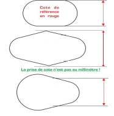

# B.4 Les distances de tir

Un parcours de tir sur cibles 3D se déroule en distances inconnues.
Le choix des cibles et des distances est laissé à l’initiative de l’organisateur.

Il existe 4 groupes de cibles 3D, répartis suivant la formule suivante :
Surface elliptique de la zone 8 x diamètre de la zone 10
Avec le calcul de la surface elliptique = π x demi grand axe x demi petit axe

- Groupe 1 : ≥ 9000
- Groupe 2 : 5000 à 8999
- Groupe 3 : 2000 à 4999
- Groupe 4 : 300 à 1999

Fourchette de distance :

- Pas rouge : 10 à 45m
- Pas bleu : 5 à 30m
- Pas blanc : 5 à 25m

Pour 24 cibles :

Les parcours doivent comporter des animaux de tailles variées à des distances variées et le cumul des
distances du piquet à la cible :

- Piquet bleu : doit se situer dans une fourchette de 490 à 520m
- Piquet rouge : doit se situer dans une fourchette de 630 à 670m

Les photographies des différents gibiers doivent être affichées globalement au greffe ou au piquet
d’attente au choix de l’organisateur.

Si ces valeurs ne sont pas respectées, le concours ne sera pas qualificatif.

|                                                              | Complément                                                   |
| ------------------------------------------------------------ | ------------------------------------------------------------ |
|  | Il existe des cibles qui n’ont pas de zone ronde. Les zones peuvent être soit ovales, soit oblongues, soit de formes indéterminées. Afin de déterminer une cote moyenne de référence, se reporter au schéma ci-contre. En prenant en référence une petite largeur (ou hauteur), le résultat obtenu est à l’avantage de l’archer. Arrondir cette mesure au cm le plus proche. |

