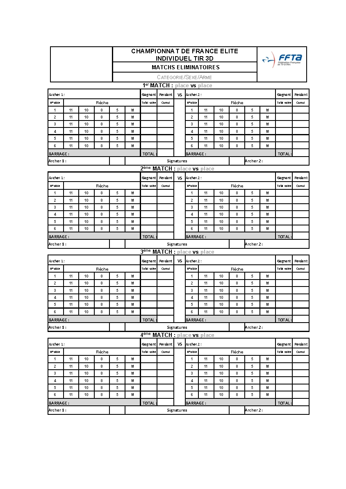

# Annexe 1 : Exemple de feuille de marque

## 1.1 : Pour le tir individuel

Feuille de marque pour les qualifications individuelles :

Feuille de marque pour les matchs éliminatoires du championnat de France Elite Individuel :

Feuille de marque pour les matchs de ½ finale et finales du championnat de France Elite Individuel 

## 1.2 : Pour le tir par équipe

Feuille de marque pour le tir de qualification du Championnat de France par équipe :

Feuille de marque pour le tir de classement du Championnat de France par équipe :

Feuille de marque pour les 8e de finale et quart de finale du Championnat de France par équipe :

Feuille de marque pour les ½ finale et finales du Championnat de France par équipe :

