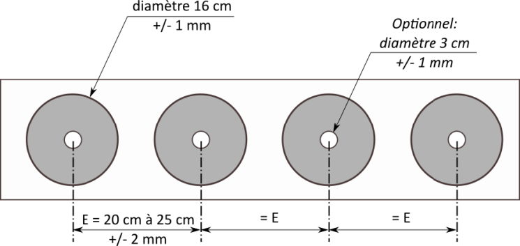

# B.1. Aménagement des sites de compétition

## B.1.1. GENERALITES.

Le site de compétition est l'emplacement sur lequel se déroulent les épreuves et les entraînements de Run-
Archery.
Le site doit être techniquement apte et doit offrir la meilleure visibilité possible aux spectateurs.

## B.1.2. EXIGENCES GENERALES.

Les aires de départ et d'arrivée, le stand de tir, la boucle de pénalité et la zone de transfert des relais doivent
être situés sur un terrain plat et à proximité de la plupart des spectateurs, avec une bonne visibilité des
activités de la compétition. Ces zones et parties critiques du parcours doivent être délimitées afin d'éviter
que les athlètes ne soient gênés ou ne s'égarent, et pour empêcher l'accès aux personnes non autorisées.
Il doit y avoir suffisamment d'espace pour que les athlètes et les officiels de compétition puissent mener les
activités requises.

## B.1.3. AIRE DE DÉPART

### B.1.3.1 GENERALITÉS.

L'aire de départ de toutes les épreuves doit être visible par les spectateurs.
L’angle de la ligne de départ avec l’axe de la course doit s’approcher le plus possible des 90 degrés. La ligne
de départ doit être matérialisée au sol.
L'aire de départ doit avoir une longueur entre 8m et 10 m et une largeur minimale de 4 m.
Elle doit être séparée de l'aire d'échauffement par une clôture avec une ouverture pour permettre un accès
contrôlé.

### B.1.3.2 INFORMATION

Il doit y avoir un tableau dans la zone de départ sur lequel la carte du parcours est affichée.
S’il y a plusieurs parcours, il doit y avoir un tableau qui montre l'ordre des couleurs de piste pour la
compétition.
Les horaires de départ doivent être affichés au moins 15 minutes avant le début de la compétition.
Un chronomètre de départ doit être placé de façon à ce qu'il soit facilement lisible depuis la ligne de départ.

### B.1.4. PARCOURS

### B.1.4.1 LA BOUCLE DE PENALITÉ.

Pour les compétitions, une boucle de pénalité doit être mise en place immédiatement après la zone de tir
(pas plus de 20 m de distance de course entre la sortie du pas de tir et l'entrée de la boucle de pénalité).
La boucle doit être un anneau de 3 m de large. La longueur de la boucle est mesurée le long du périmètre
intérieur de l’anneau. L'entrée et la sortie de la boucle de pénalité doivent être clairement marquées au
moyen de panneaux pour éviter les erreurs.

### B.1.4.2 ZONE DE PASSAGE DE RELAIS

Il doit y avoir une zone de passage de relais bien marquée, longue de 15 m et large de 6 m au minimum,
située en ligne droite.
La zone de passage de relais doit commencer à la ligne de chronométrage. Le début et la fin de la zone
doivent être matérialisés par une ligne au sol et une signalisation au début : "Zone de Relais"

## B.1.5. STAND DE TIR

### B.1.5.1 GENERALITES.

Le stand de tir doit être situé dans la zone centrale du site, les cibles et la ligne de tir doivent être visibles
pour la majorité des spectateurs. Le stand de tir doit présenter une sécurité adéquate sur les côtés et à
l’arrière des cibles. Le stand de tir doit être mis en place dans le strict respect de la sécurité par rapport
aux diverses boucles.

### B.1.5.2 SPECIFICATIONS ET CONFIGURATIONS.

#### B.1.5.2.1 Distance de tir.

La distance entre la cible et la ligne de tir doit être de 18m (+/- 10 cm). Le terrain doit être mis à l’équerre
et la mesure est effectuée avec précision à partir d'un point partant de la verticale du centre de chaque
cible jusqu'à la ligne de tir.

#### B.1.5.2.2 Ligne de tir.

Chaque athlète disposera d’un espace d’une largeur de 1,75m minimum, nettement matérialisé sur la
forme d'un rectangle (appelé « zone de tir de l’athlète »).
Le centre de cet espace, directement opposé au centre de chaque cible, sera marqué du n° correspondant
à cette cible et placé 1 à 2 m devant la ligne de tir.

#### B.1.5.2.3 Tapis de tir.

Si des tapis de tir sont utilisés, ils sont placés derrière ligne de tir. Leur surface ne doit pas être glissante.

#### B.1.5.2.4 Configurations spatiales.

À l'arrière du pas de tir, une zone clôturée de 7,5 à 8,5 m, s'étendant sur toute la longueur du pas de tir
est réservée aux athlètes et aux officiels. L'espace réservé au public et aux entraîneurs doit être défini à un
minimum de 10 mètres derrière la position des observateurs. L'entrée et la sortie du stand de tir doivent
être clairement délimitées.

L’entrée et la sortie de la zone de tir doivent être clairement délimitées.
A l’entrée de la zone de tir des plots doivent être mis à disposition des athlètes qui ne possèdent pas un
carquois de dos adapté. Ces plots doivent porter le numér- de départ de l’athlète propriétaire des flèches
qui y sont déposées.
Des plots doivent être disposés à chaque couloir de tir pour y déposer les flèches lors des épreuves finales
et les relais.

Lorsque l'arc est porté dans le dos, il ne doit être retiré et replacé dans le dos que dans la zone de tir de
l’athlète, sans déranger les athlètes qui se trouvent sur les cibles adjacentes.

Placé convenablement sur le stand de tir, il doit y avoir des supports pour les arcs de rechange pour les
athlètes pendant les compétitions et les entraînements. Chaque arc doit porter le numér- de départ de
l’athlète à qui il appartient.

### B.1.5.3 CIBLES.

Il y a deux types de cibles utilisées :

- cibles à bascule ;
- cibles avec blasons papier.
  Le même type de cibles doit être utilisé pour tous les athlètes d'une même compétition dans la zone de tir.
  Les cibles à bascule doivent être vérifiées avant la compétition.

#### B.1.5.3.1 Cibles avec blasons papier.

Les blasons doivent être fixés sur un support adapté pour arrêter les flèches.
La zone à atteindre est circulaire d’un diamètre de 16cm (+/- 1 mm) et avec un centre d’un diamètre de
3cm (+/- 1mm). La limite de zone à atteindre et délimitée par un trait de 1 à 2 mm d’épaisseur qui doit se
trouver entièrement dans la zone de 16 cm (+/- 1 mm). L’écart des zones marquantes d’un blason est de
25 cm maximum (+/- 2 mm) de centre de zone à centre de zone.
Dans l’attente d’une disponibilité de blasons homologués, les organisateurs doivent respecter les points
suivants :

- le contraste de couleur entre le fond et la zone à toucher doit être suffisant pour que l’athlète puisse
  appréhender la zone à viser et que les spotters puissent juger les points dans les meilleures conditions

- la couleur de la zone doit permettre de distinguer facilement les flèches qui l’ont touchées (le noir n’est
  pas autorisé) ;
- les matières utilisées pour le fond et la zone à toucher ne doivent pas être brillantes (risque d’éblouir
  l’athlète au moment de la visée].

#### B.1.5.3.2 Cibles à bascule

Les cibles basculantes sont composées d'éléments rabattables en matériaux qui n'endommagent pas les
flèches.

La forme et les dimensions des deux cibles sont indiquées dans le diagramme suivant :

#### B.1.5.3.3 Installation des cibles.

Les cibles doivent être placées de façon à ce que le centre du support de cible (et du blason si utilisé) soit
(soient) aligné(s) avec le milieu de l’espace correspondant matérialisé sur la ligne de tir. Les cibles doivent
former une ligne visuellement droite, le centre des cibles étant en moyenne à 105 cm (+/-2 cm) du sol.

#### B.1.5.3.4 Protection à l’arrière de cibles.

Derrière les cibles, il doit y avoir un filet ou un dispositif pour arrêter les flèches qui ont manqué les cibles.

#### B.1.5.3.5 Numérotation des cibles.

Les espaces de la ligne de tir et les cibles correspondantes doivent avoir les mêmes numéros, facilement
visibles, et commençant au plus loin de l’entrée. La taille des numéros de cibles est au minimum de 30 cm
de haut. Les numéros de cible doivent être placés à la verticale du centre du support de cible, en-dessous
de chaque cible.

#### B.1.5.3.6 Indication du vent.

Un dispositif de visualisation du vent (manche à air, drapeau, etc.) doit être installé de part et d’autre de la
zone des cibles.

## B.1.6. AIRE D’ARRIVÉE

L'aire d’arrivée de toutes les compétitions doit être visible par les spectateurs.
Les 50 derniers mètres avant la ligne d’arrivée doivent être en ligne droite et d’une largeur minimale de
4m.
Seuls les athlètes et les officiels sont autorisés dans la zone d’arrivée.
La ligne d’arrivée doit être matérialisée au sol.

## B.1.7 ÉQUIPEMENT DE CHRONOMÉTRAGE

Pour le chronométrage manuel, il faut utiliser des chronomètres qui permettent de prendre autant
d’enregistrements de temps consécutifs (au 1/10 de seconde ou au 1/1O- selon la compétition
organisée) qu’il y a de compétiteurs sur la course.
