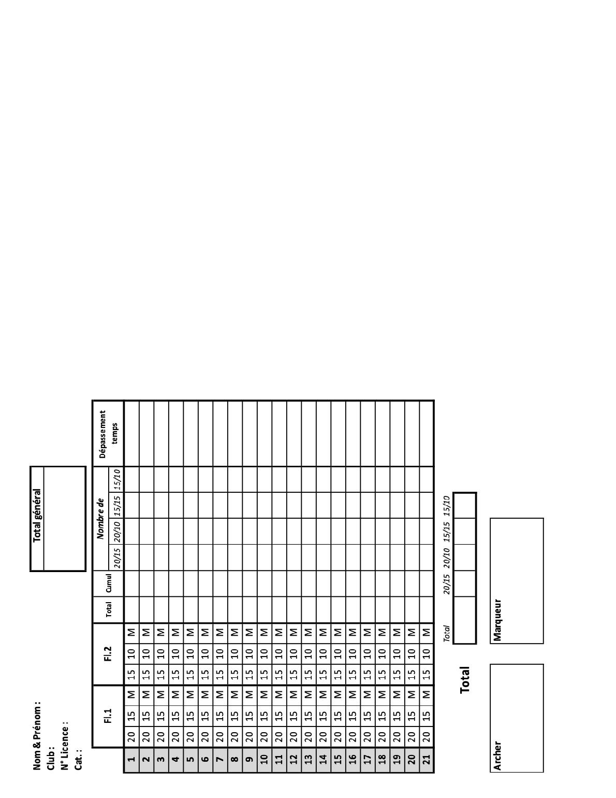
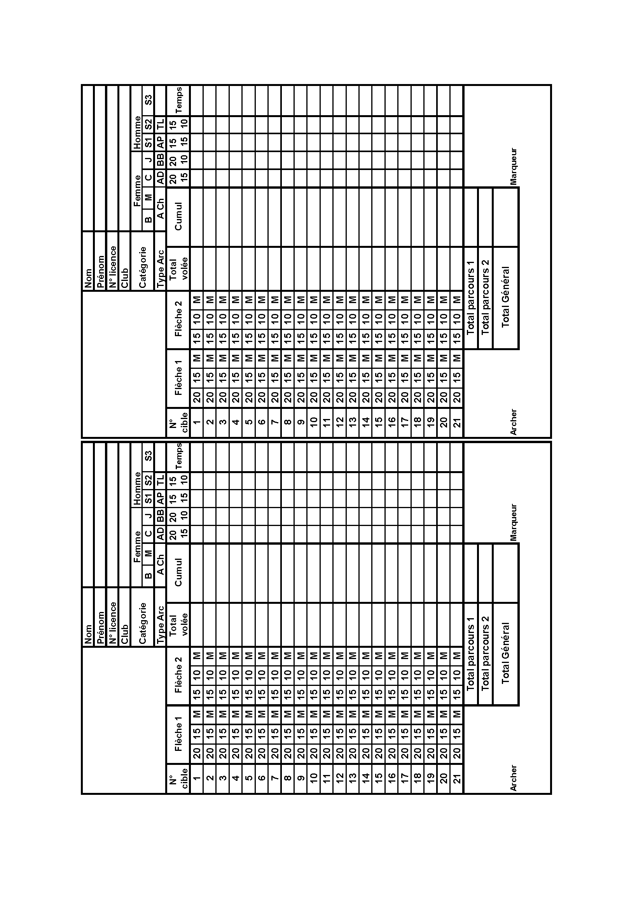
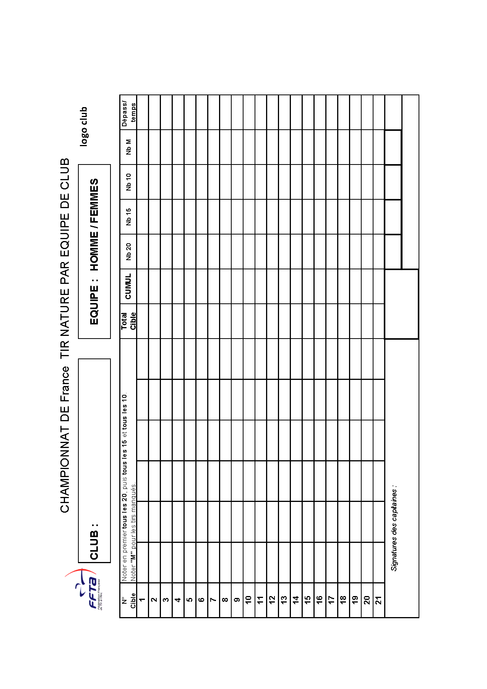

# Annexe 1 : Exemple de feuille de marque

## 1.1 : Pour le tir individuel
Feuille de marque pour les qualifications individuelles sur concours qualificatif : Edition Recto Verso

Pour les qualifications du championnat de France Individuel :

## 1.2 : Pour le tir par équipe
Feuille de marque pour le championnat de France par équipe :

